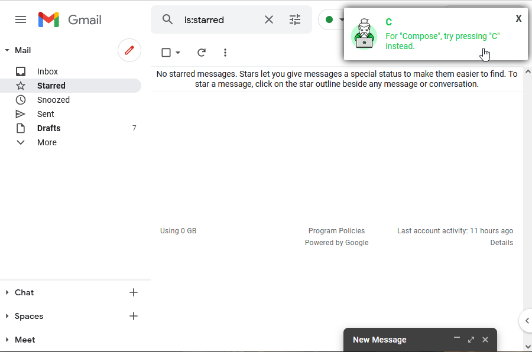

	

# Shortcut Sensei
A cross-browser extension teaching keyboard shortcuts for Gmail.com in English (more web-apps are planned).

Shortcut Sensei provides instant feedback when an action is performed with the mouse instead of using the associated keyboard shortcut (see example image below).

# Installation

Add Shortcut Sensei from:
- [Chrome Web Store](https://chrome.google.com/webstore/detail/shortcut-sensei/ahhliekflgdfbgofmgamanngngnbaibh/related) or
- [Firefox Add-Ons Store](https://addons.mozilla.org/en-US/firefox/addon/shortcutsensei/).

# Contribute

Please contribute to the development of Shortcut Sensei.

Report bugs & give feedback:
- via [feedback@shortcutsensei.com](mailto:feedback@shortcutsensei.com)
- [report a github issue](https://github.com/janmechtel/shortcutsensei/issues/new)
- [visit us on discord](https://discord.gg/K28Bnpts53)

The GNU GPLv3 license offers you permission to copy, modify and distribute the code, provided that your modifications and additions are also open-source.

Thank you!

# How to run
1. `npm install`
2. `npm run watch`
3. `web-ext run` for Firefox and `web-ext run -t chromium` for Chrome

# How to build
1. `npm install`
2. `npm run build`
3. `web-ext build`
